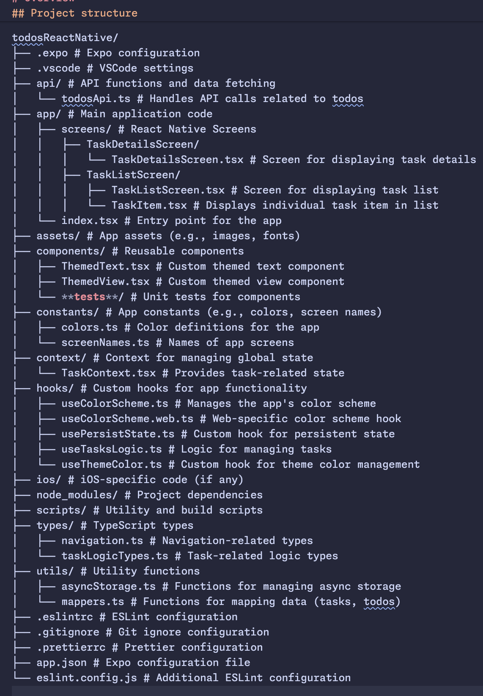
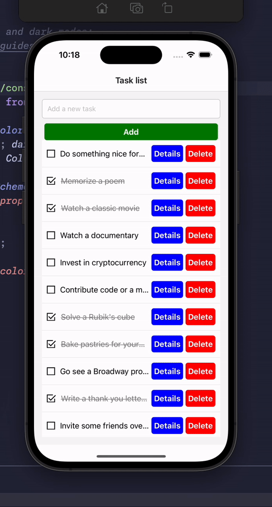

# Overview

This is an [Expo](https://expo.dev) project created with [`create-expo-app`](https://www.npmjs.com/package/create-expo-app).

This project is a ToDo application built using React, TypeScript, and Expo. It offers functionalities like adding, deleting, and toggling the completion status of tasks, going to details page, saving tasks between app launches. The app communicates with a dummy API that simulates task management, but the API does not persist changes (e.g., adding, deleting, or toggling tasks) so it manage Task (local structure) and Todo (API structure) and doesn't send local created task to API, to avoid 5xx error. App use react hooks, styled-components and Context to manage state

## Features

- Task Management: Add, delete, and toggle completion status of tasks.
- State Management: Uses React context to manage app state and tasks globally. All state and tasks managing logic lives in TaskContext
- Custom Hooks: Reusable hooks like useTasksLogic for task management, and usePersistState for persistence.

## Get started

1. Install dependencies

   ```bash
   npm install
   ```

2. Start the app

   ```bash
    npx expo start
   ```

In the output, you'll find options to open the app in a

- [development build](https://docs.expo.dev/develop/development-builds/introduction/)
- [Android emulator](https://docs.expo.dev/workflow/android-studio-emulator/)
- [iOS simulator](https://docs.expo.dev/workflow/ios-simulator/)
- [Expo Go](https://expo.dev/go), a limited sandbox for trying out app development with Expo

You can start developing by editing the files inside the **app** directory. This project uses [file-based routing](https://docs.expo.dev/router/introduction).

## Get a fresh project

When you're ready, run:

```bash
npm run reset-project
```

This command will move the starter code to the **app-example** directory and create a blank **app** directory where you can start developing.

## Project structure



## Project quick review


